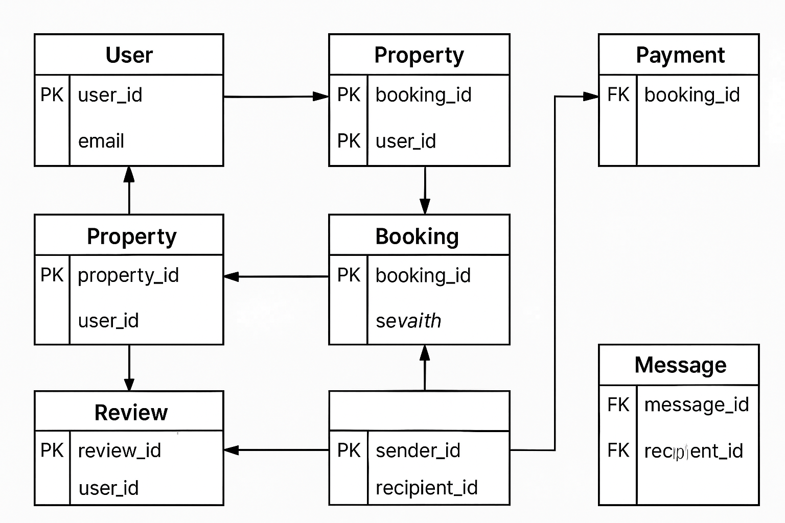

 🗺️ Entity-Relationship Diagram (ERD) for Airbnb Database

 📌 Objective
To model the Airbnb system database by visually representing entities, their attributes, and the relationships among them. This ERD will serve as the foundation for building and normalizing the database schema.

---

 🔧 Tools Used
- Draw.io: For designing the ER diagram.
- PNG/JPG Export: The diagram is included below.

---

 📦 Entities and Their Attributes

 1. User
- user_id (PK)
- first_name
- last_name
- email (UNIQUE)
- password_hash
- phone_number
- role (guest, host, admin)
- created_at

 2. Property
- property_id (PK)
- host_id (FK → User)
- name
- description
- location
- pricepernight
- created_at
- updated_at

 3. Booking
- booking_id (PK)
- property_id (FK → Property)
- user_id (FK → User)
- start_date
- end_date
- total_price
- status (pending, confirmed, canceled)
- created_at

 4. Payment
- payment_id (PK)
- booking_id (FK → Booking)
- amount
- payment_date
- payment_method (credit_card, paypal, stripe)

 5. Review
- review_id (PK)
- property_id (FK → Property)
- user_id (FK → User)
- rating (1–5)
- comment
- created_at

 6. Message
- message_id (PK)
- sender_id (FK → User)
- recipient_id (FK → User)
- message_body
- sent_at

---

 🔗 Relationships Overview

| Relationship                 | Type          |
|-----------------------------|---------------|
| User ↔ Property              | One-to-Many   |
| User ↔ Booking               | One-to-Many   |
| Property ↔ Booking           | One-to-Many   |
| Booking ↔ Payment            | One-to-One    |
| User ↔ Review                | One-to-Many   |
| Property ↔ Review            | One-to-Many   |
| User ↔ Message (Sender/Rec.) | One-to-Many   |

---

 🧩 ER Diagram

> _This diagram represents all entities, attributes, and foreign key relationships._

---

 📝 Notes
- All UUIDs are primary keys.
- Foreign keys enforce referential integrity.
- ENUM values are used to constrain specific fields like `role`, `status`, and `payment_method`.
